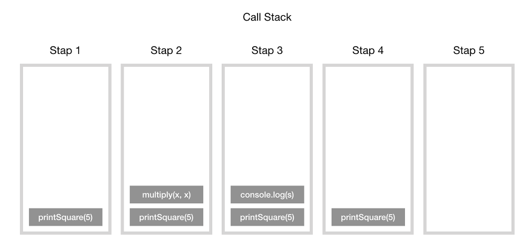
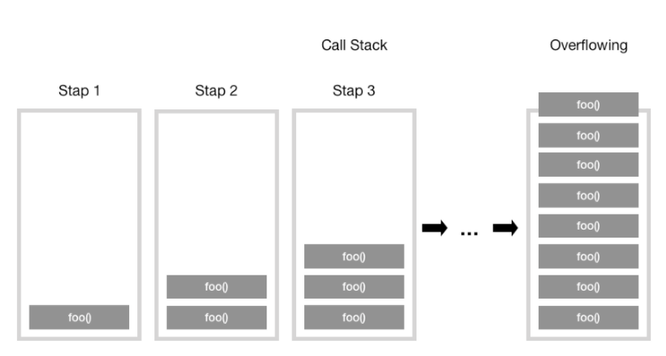
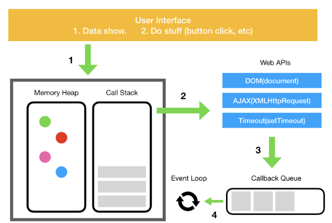

# 개요

자바스크립트는 단일 스레드 프로그래밍 언어이므로, 단일 호출 스택( = 한번에 하나만 처리가능) 이다.

호출 스택이란 프로그램에서 현재 위치가 어디있는지 기록하는 데이터 구조이다.

호출 스택의 각 항목을 스택 프레임 이라고 한다.

함수를 실행하면 해당 함수 기록을 스택 맨 위에 추가(Push)하고 실행이 끝나면 제거(Pop) 된다.

## 예제

```jsx
function multiply(x, y) {
    return x * y;
}
function printSquare(x) {
    var s = multiply(x, x);
    console.log(s);
}
printSquare(5);
```



# 스택 오버플로우

스택의 사이즈를 초과 했을 때 발생하는 오류이다.

생각보다 쉽게 일어날 수 있는 오류이다. 특히, **재귀 호출**을 할 경우 자주 발생할 수 있다.

```jsx
function foo() {
    foo();
}
foo();
```



# 단일 호출 스택의 문제점

단일 스레드에서 코드를 실행하는 것은 멀티 스레드 환경보다 매우 쉽다.

그러나 단일 스레드는 상당히 제한적이다. 

- 이슈1: 브라우저에서 복잡한 이미지 처리를 할 경우 자바스크립트는 이미지 처리 작업 스택을 차지하고 있는 경우 후속 작업을 진행할 수 없다.
- 이슈2: 브라우저가 호출 스택에서 많은 작업을 처리하기 시작하면 응답이 멈출 수 있다.

그러면 위와 같은 이슈를 해결 할 방법은 없을까?

## 비동기 콜백

위 이슈를 해결하기 위한 가장 쉬운 해결책으로, 코드를 일부 실행하고 나중에 실행될 콜백 함수를 제공한다.

비동기 콜백은 즉시가 아닌, 특수한 시점에 실행되므로 스택안에 바로 push 될 필요가 없다.

콜백 함수들은 이벤트 큐(Event Queue)에 저장되는데 이는 처리할 메시지 목록과 콜백 함수 들의 리스트이다.



## 처리과정

이벤트 발생(버튼 클릭) → DOM 이벤트, http 요청, setTimeout 과 같은 비동기 함수는 web API를 호출 → web API는 콜백 함수를 Event Queue(Callback Queue)에 밀어 넣음 → Event Queue는 대기하다가 Stack이 텅 비는 시점에 Event Loop를 실행함

Event Loop의 기본 역할은 큐와 스택 두 부분을 지켜보다가 스택이 비는 시점에 콜백을 실행시켜 준다.

웹 브라우저에서는 이벤트가 발생할 때마다 메시지가 추가되고 이벤트 리스너가 첨부된다. 따라서 리스너가 없으면 이벤트가 손실된다. 콜백 함수의 호출은 호출 스택의 초기 프레임으로 사용되며, 자바스크립트가 단일 스레드이므로 스택에 대한 모든 호출이 반환될 때까지 메세지 폴링(polling) 및 처리가 중지된다. 동기식 함수 호출은 이와 반대로 새 호출 프레임을 스택에 추가한다.
