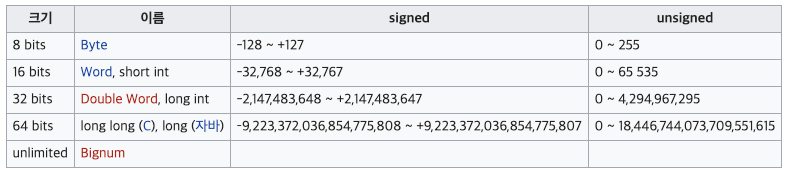

## 개요

원시 자료형은 컴퓨터 과학에서 프로그래밍 언어가 제공하는 자료형 중 하나이다. 언어와 구현에 따라서, 메모리 상에 일대일로 대응되는 객체(Object)를 가질 수도 있다.

실제 원시형의 범위는 프로그래밍 언어에 따라 다르다. 예를들어 "C"에서 문자열은 조합형이지만, 베이직 or 자바스크립트에서는 기본형으로 취급한다.

일반적으로 원시형은 다음과 같다.

- 문자(character, char)
- 다양한 정수(integer, int, short, long, byte)
- 부동소수점수(float, double, real, double precision)
- 다양한 정밀도와 프로그래머가 지정 가능한 크기를 갖는 고정 소수점 수(fixed)
- Boolean('참' or '거짓')
- 참조(pointer or handle) 다른 개체의 메모리상 주소를 참조하는 값

## 분류


### 정수형 숫자

정수형은 소숫점을 제외한 모든 숫자값을 가질 수 있다.



### 불린

일반적으로 'bool' or 'boolean'으로 표시되는 불린 자료형은 단일비트 타입니다. 그 값은 'true'(1) or 'false'(0)으로 제한되어 있다. "C++"과 같은 몇몇 언어에서는 불린값들은 암시적으로 정수형 변환될 수 있다. 
예를 들어 "true + true"의 값이 2일 수 있다.

### 부동 소수점 수

부동 소수점 수는 소수점 값을 포함한 실수를 표현한다. 이 숫자는 지수법, 이진법, 간혹 십진법으로 표기되기도 한다. 부동 소수점 수는 제한된 자릿수를 갖기 때문에, 모든 값은 근사적으로 표시된다. 많은 언어들은 "float"라고 부르는 single precision과 double precision 타입을 갖는다.

### 고정 소수점 수

고정 소수점 수는 소수 부분을 갖고 있는 실수를 표현한다. 이 수는 내부적으로 scaled-integer 폼으로, 일반적으로 이진법으로 하지만 가끔 십진법으로 저장된다. 고정 소수점 수는 오직 제한된 자릿 수만을 표기할 수 있기 때문에, 대부분의 값은 근사적으로만 표기될 수 있다. 고정 소수점 수는 제한된 범위의 값을 가지므로, 프로그래머는 반드시 그 값이 오버플로우 되지 않도록 주의해야 한다.

### 문자형과 문자열

일반적으로 'char'라 쓰는 문자 타입은 하나의 문자, 숫자, 문장부호 혹은 제어문자를 갖는다.

문자의 조합이 문자열인데 대부분의 언어에서 문자열은 문자의 배열과 동치이나, 자바에서는 별개의 타입으로 처리된다. 문자와 문자열을 위한 표기 방법은 따옴표로 해당 문자를 감싸는 것이 보통이다. 문자는 작은 따옴표로 문자열은 큰 따옴표로 감싼다.

### 숫자형 데이터 범위

각 숫자형 데이터는 최솟값과 최댓값으로 제한된 범위를 갖는다. 제한된 범위를 넘어서는 숫자가 생긴다면 컴파일 에러나 런타임 에러를 마주하게 되거나, 운이 없다면 (버림 처리로 인한) 잘 못된 연산값을 얻게 될 것이다. 이는 사용된 언어에 따라 결정된다.

## JavaScript의 원시 자료형

JavaScript에서 기본 자료형 혹은 원시 데이터 타입(Primitive Data Type)이라 불리는 것들에는 숫자, 문자열, 불리언, null, undefined가 있다.

### 숫자(Number)

JavaScript는 정수와 실수를 구분하지 않고 모든 숫자를 IEEE754 표준에 정의한 Double 타입의 실수로 표현한다. 즉, 다양한 실수 표현이 가능하다는 뜻으로 이해하면 된다.

```javascript
var num = - 42;
var pi = 3.14;
var hexNumber = 0xfff;
var octalNumber = 0o777;
var binaryNumber = 0b111;
var exp = 2e6;
```

### 문자열(String)

문자열은 텍스트를 큰 따옴표나 작은 따옴표로 감싸서 표현한다.

문자열 내부에 특수 문자를 사용하려면 이스케이프라는 것을 해야한다. 즉 작은 따옴표로 감싼 문자열 내부에서 작은 따옴표로를 사용한다거나, 단어와 단어사이에 탭을 추가하거나 하는 용도로 사용할 수 있다.

```javascript
'I\'m Alice'
'My name is \t Alice'
```

### 불리언(Boolean)

불리언은 참과 거짓 두개의 진리값을 표현하기 위해 사용한다.

JavaScript의 값 중에는 자동으로 false로 평가되는 값이 있는데 아래와 같다.

```javascript
0, -0
""  // 빈문자열
NaN
null
undefined
```

### null & undefined

undefined는 값이 할당되지 않았다는 것을 표현한다. 변수 선언 시 값을 할당하지 않으면 undefined가 된다.

null은 아무런 값도 아니다라는 것을 표현하기 위해 사용한다. 변수에 null을 할당하면 아무런 값도 없다는 것을 뜻한다.

## 동적 타입 언어

JavaScript에서는 특정 변수에 숫자를 대입했더라도 추후 얼마든지 문자열과 같은 다른 데이터 타입의 값을 대입할 수 있는데 이처럼 변수에 저장된 자료형을 동적으로 바꿀 수 있는 언어를 동적 타입(dynamic type)언어 라고 한다.
